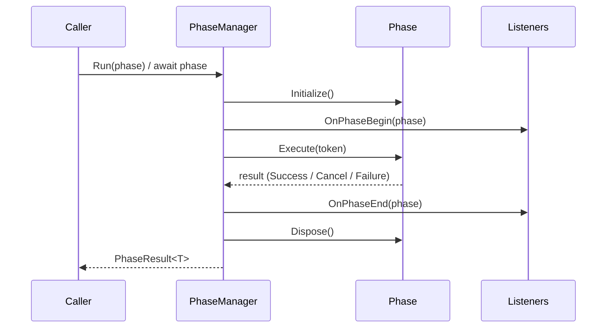

## What is a phase?
A **phase** is a single, well-defined *step* in your game: a turn, a round, a loading sequence, an intro cutscene, the resolution of an attack, a shop screen. The **Phases** system gives those steps a first-class representation that is:

- **asynchronous** — a phase runs over time using Unity's `Awaitable`, so `await`-ing it is natural;
- **cancellable** — every phase carries a `CancellationToken` and can be stopped cleanly;
- **observable** — any number of independent systems can react to a phase *beginning* and *ending* without the phase knowing they exist;
- **result-bearing** — a phase can return a value when it completes.

The goal is to stop scattering game-flow logic across `bool isMyTurn`, coroutines, and manual event wiring, and instead express *"this step is happening"* as an object you can run, await, cancel, and observe.

## The mental model
Two roles, deliberately decoupled:

- The **phase** knows *what to do* (its `Execute` body) and nothing about who is watching.
- The **listeners** know *how to react* when a phase begins or ends, and nothing about the phase's internals.

This is why a UI, an analytics logger, and a sound manager can all react to your `TurnPhase` without any of them referencing each other.

## Lifecycle at a glance
When a phase runs, it always goes through the same ordered steps:

1. **`Initialize`** — setup, run **before** any listener's begin callback.
2. **listeners' `OnPhaseBegin`** — everyone is told the phase started.
3. **`Execute`** — the actual work; produces the result.
4. **listeners' `OnPhaseEnd`** — everyone is told the phase ended.
5. **`Dispose`** — teardown, run **after** every listener's end callback.

Its `CurrentStatus` moves through `None → Running → Completed` (or `Canceled` / `Failed`).

## Results
A phase never just "returns a value"; it returns a `PhaseResult<T>` that says **how** it ended:

| `PhaseResultType` | Meaning |
| --- | --- |
| `Success` | `Execute` completed normally; `value` holds the result. |
| `Cancel` | The phase was cancelled (its token was triggered). |
| `Failure` | `Execute` threw an exception (logged automatically). |

`PhaseResult<T>` converts implicitly to both its `value` (`T`) and its `type`, so you can use whichever you need.

## Where to go next
- [Defining a phase](./2_defining-a-phase.md) — write your own phase types.
- [Running phases](./3_running-phases.md) — start, await, and cancel them.
- [Listeners](./4_listeners.md) — react to phases from anywhere.
- [Single phases](./5_single-phases.md) — guarantee only one runs at a time.
- [Waiting utilities](./6_waiting-utilities.md) — await phases you don't own.

:::warning[Main thread]
The Phases system is built on Unity's `Awaitable` and is **main-thread only**. Call `PhaseManager` methods and complete phases from the Unity main thread.
:::
